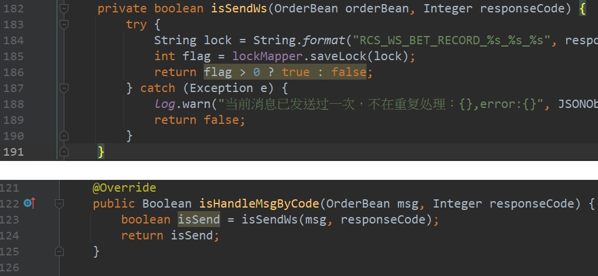
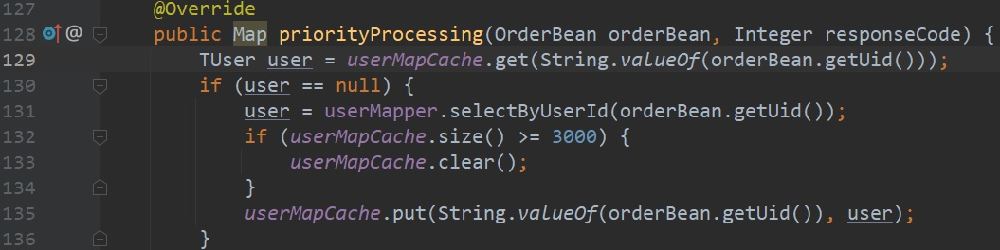
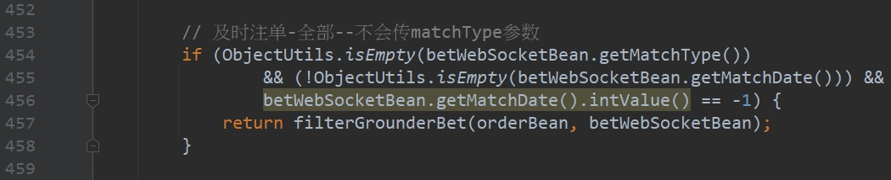
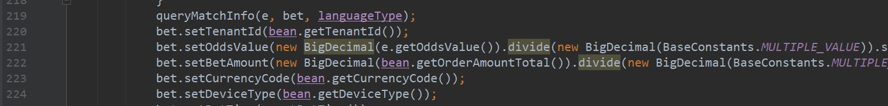
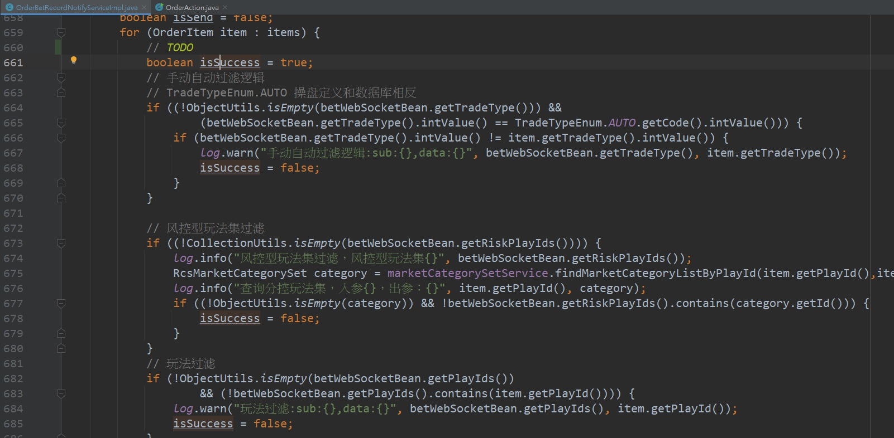
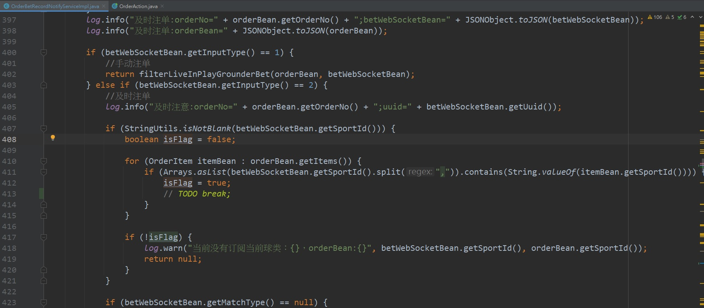
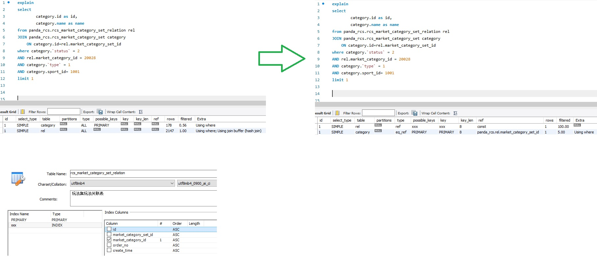

# 寫法優化
### 魔法數字
> 用 Enum 

### IDE 提示的黃底
1. 冗餘的寫法

2. 泛型

3. autoboxing

4. BigDecimal 建構子用字串型態，除法使用重載 3 個參數的方法

### 增加方法

> 用到 isSuccess 變數可以提出來變成一個新方法並回傳

# 效能優化
### 提早結束判斷

> isFlag 變數有改變就不需要再跑迴圈了

### 增加索引

> 為 rcs_market_category_set_relation.market_category_id 增加索引可加快查詢速度

